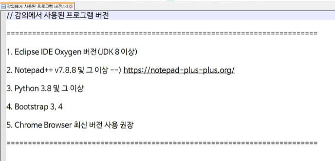
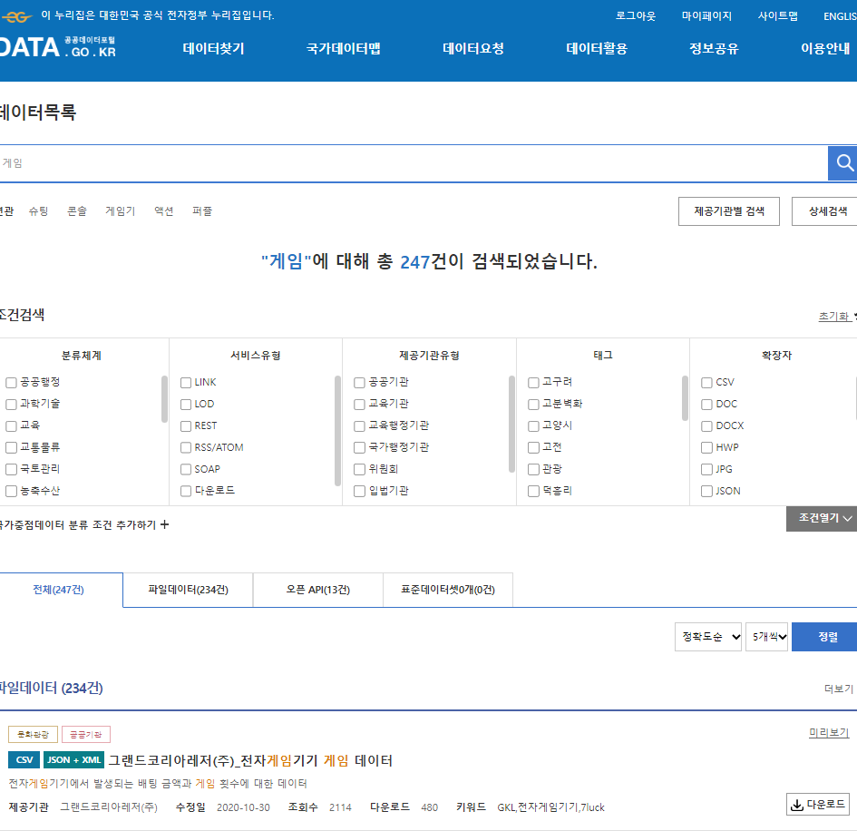
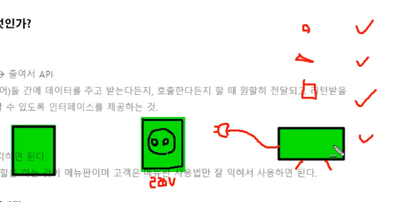
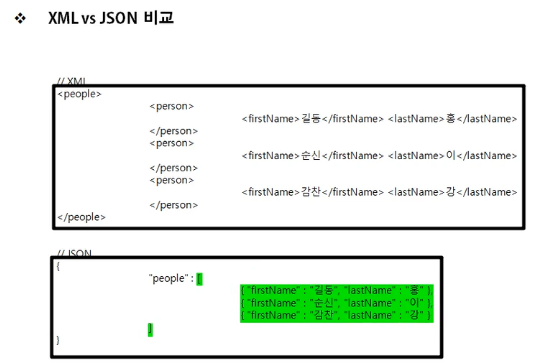

# 📖 목차

[강의 개요](#강의-개요)

[강의에서 사용된 프로그램 버전](#강의에서-사용된-프로그램-버전)

[공공데이터 API 이용하기 - 전체적인 흐름 미리보기](#공공데이터-api-이용하기---전체적인-흐름-미리보기)

[API 개념이해](#api-개념이해)

[JSON 개념이해](#json-개념이해)

# 강의 개요

- 요즘은 많은 대기업 및 포털사이트 등에서도, 오픈데이터 라는 이름으로~ 많은 데이터를 공개하고 있죠?

    - 이걸 어떻게 사용하고 이용하는 지에 대한 과정

- 인증키를 발급받고 이런것도 알려주시나봄

    - 인증키 어떻게 등록하고 - 보통 API 받으려면 이걸 해야 한대요

        - 회원가입도 해야겠죠?

    - 신청하고 나서? -> 발급받아서! 이용하고 활용 하는 것에 대해

- 선수학습: 각 프로그래밍 언어에 대한 문법 학습 필요

    - JSON(XML)

    - AJAX

    - JavaScript / jQuery

    - DOM

- 거의 JSON 형태로 제공을 하거든요

    - 이걸 처리하기 쉽게 해주는 라이브러리도 굉장히 많구요

    - 자바스크립트 오브젝트 노테이션

# 강의에서 사용된 프로그램 버전

- 파이썬

    - 모듈 을 사용하게 될텐데요

    - 뭐 그때그때 설치하면 되겠어요

    - 저는 3.9.2가 설치되어 있어요

    - 데이터베이스는 SQLite3 쓸거구요! 이건 파이썬에 기본적으로 내장이 되어 있어요

- 노트패드++ 이런건 뭐.. 저는 VScode 쓸게요

# 공공데이터 API 이용하기 - 전체적인 흐름 미리보기

- 회원가입 하고

    - 인증키 발급 받아서

    - 인증키를 등록을 해서

    - JSON 형태로 데이터를 받으면

    - 그걸 써요

🔗[data.go.kr](https://www.data.go.kr/)

- 가장 대표적인 공공 데이터 포털이죠?

- 자료가 정말 많아서

    - 서치를 한다고 해도.. 기본적으로 몇 천 건 씩 검색이 되거든요

    - 그 중에서 내 목적에 맞는 데이터를 가져오는게 쉽지 않을 수도 있는데

    - 데이터 포멧 어떤 것들로 제공되는지도 다 옆에 나온답니다

🔗[developers.kakao.com](https://developers.kakao.com/)

- 카카오 디벨로퍼스

- 여기도 뭐 회원가입 하고 인증키 어쩌구 하는 흐름~ 비슷비슷 하죠

---

- 일반적인 포털사이트에서 검색 하듯이

    - ex) 보행자 무단횡단 사고 다발지역 정보 서비스

    - 굉장히 많이 결과가 나온답니다

- 미리보기 뭐 그런것도 있고요

- 다운 받을 수도 있고

- 제공 기관 뭐 이런 정보도 나타나 있고요

- 활용 신청 이런 것도 있고요

    - 바로 이용할 수 있는 게 아니에요

    - 빠르면 몇 시간 안에도 승인이 난다네요

    - 신청 하면서..

        - 용도? 이런거 쓰는 란도 있대요

        - 테스트 합니다.. 뭐 이런 거 쓰고 그런가봐요

        - 이거 승인 기다리려면 진도가 좀 늦춰질 수도 있으려나

- 미리보기 누르면

    - API 유형 이런거 볼 수 있고 어쩌구

    - 어떻게 제공이 되어지는지~

    - 어떤 형태로 제공이 되어지는지

- 제목 클릭해서 상세페이지 들어가면

    - 좀 더 디테일한 정보 볼 수 있고

    - 활용 신청 뭐 이런것도 여기에도 있고

    - 승인 절차 정보 같은 것도 쓰여 있고요

    - 샘플 데이터 이런 것도 ㅣㅇㅆ고

    - 굉장히 많아요 정보가

- 아무튼 여기서는.. 데이터를 `제공 받는 것`까지만 한답니다

    - 재료를 받았어요

    - 가공을 해서, 보기 좋게, 예쁘게? 필요한 것을 쏙쏙 빼서! 웹에 뿌려준다거나~ 하는 건 사용자의 몫이 되는 거죠

# API 개념이해

- API란?

    - Application Programming Interface

    - 일종의 약속, 응용프로그램(sw)들 간에 데이터를 주고 받는다든지, 호출한다든지 할 때 원활히 전달되고 리턴받을 수 있도록, 또는 기능을 원활히 사용할 수 있도록 인터페이스를 제공하는 것

- 식당의 메뉴판 같은 것

    - 고객과 주방을 이어주는(상호작용) 역할을 하는 것이 메뉴판

    - 고객은 메뉴판 사용법만 잘 익혀서 사용하면 되죠?

- 돼지코 가 인터페이스 역할을

    - 다리 역할.. 매개체 역할..

- 데이터베이스 구축 후에, 외부에 서비스 할 때

    - (1) 직접적인 데이터 전달

    - (2) DB 직접 접근
        
        - 보안 상.. 이런 경우는 드물구요

    - (3) API 방식으로 이용 등

    - 데이터베이스 구축 한다는 거 가 어려운 거 거든요

- API 표준화

    - 특정 기기나 OS에 종속되지 않도록 구현함

    - 다양한 프로그래밍 언어로 접근하여 사용 가능

- API를 이용한 애플리케이션 개발 및 여러 서비스 기획안 창출

# JSON 개념이해

- JSON 이란?

    - JavaScript Object Notation

        - 사전 뜻 그대로

        - 자바스크립트 객체 표기법(표현)
    
    - 자바스크립트에서 객체를 만들 때 사용하는 표현식

    - 주로 서버와 웹페이지 간, 어떤 데이터를 주고 받을 때 많이 사용하는 포맷 형식

    - 프.언은 아니고.. 문법도 아니고.. 단지 하나의 데이터 저장 방식

        - 문법은 아니라지만 규칙은 있어요

- 왜 써요?

    - B2B, B2C 서비스 시, 상호간 데이터를 주고받는 경우가 많아요

    - 이 때, 객체 상태로 데이터를 전달하는 건 불가

        - `객체`를 `문자열`로 변환해서 전달 해줘야 함

        - 받은 쪽에서는 다시 문자열을 객체로 변환해야 하지만 아무튼

            - 객체를 바로 전달할 수 있으면 좋겠지만

                - OS나 프.언이 다를 때.. 전달 자체가 안되더라

                - 시스템 적인 문제.. 호환의 문제

        - 해당 프로그래밍 언어에서 객체로써 사용할 수 있다

    - 이러한 변환 과정 사용법을 잘 숙지하고 파싱하여 웹페이지단에서 데이터를 사용자에게 출력

    - 각 언어마다 이러한 변환 작업을 편리하게 해주는 여러 유용한 라이브러리들이 있습니다요

- 어떻게 만드나?

    - JSON은 `"속성: 값"` 또는 `"key: value"`의 쌍으로 이루어진 데이터 객체를 전달하기 위해 만들어진 포맷

    - 프로퍼티나 값을 `쌍따옴표`로 표시

    - 자바스크립트에서 배열과 객체를 만드는 방법과 비슷
    
        - 배열과 객체를 하나의 데이터에 적용

- XML하고 비교를 자주 하는데요

- JSON의 특징

    - 일단 보기에 좋은 구조이고, 텍스트를 사용

    - 비동기 처리 기반의 브라우저/서버 통신 등에서 데이터를 주고 받을 때 많이 사용

    - 예전에 많이 사용하는 XML을 대체 -> XML은 헤비하고 넘 복잡 ㅠ

    - 거의 모든 언어를 지원

    - 계층적인 구조 -> XML도 마찬가지긴 함

- 차이점

    - XML과 달리, 종료하는 end tag가 필요 없음

        - 아~ JSON보다 더 간결하고 짧네요
    
    - JSON은 배열을 사용할 수 있다

        - 아까.. 배열과 객체를 하나의 데이터에 적용한 포맷이라고 했죠?

