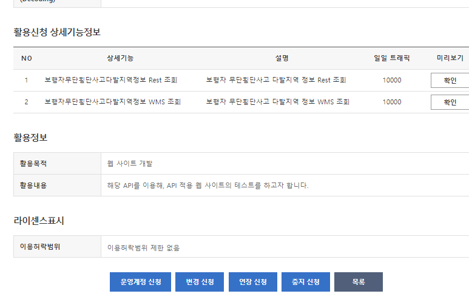
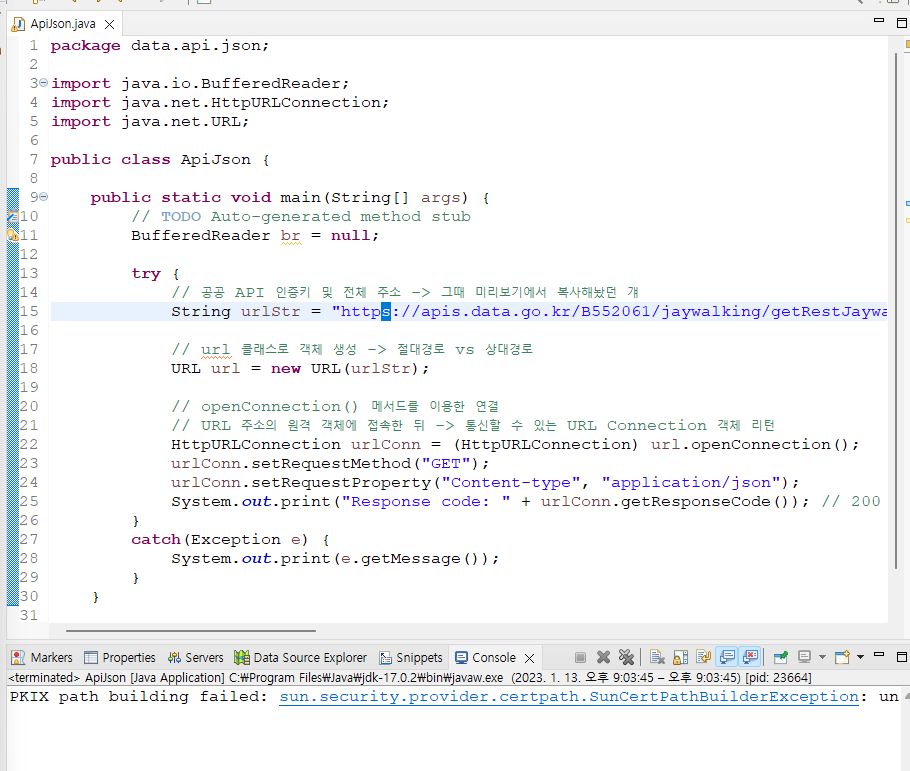
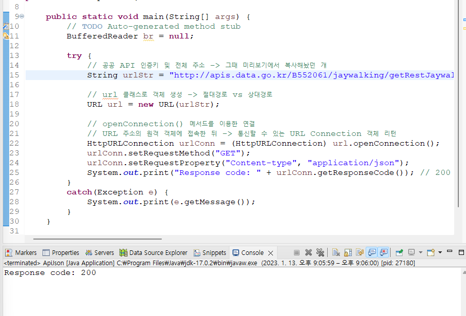
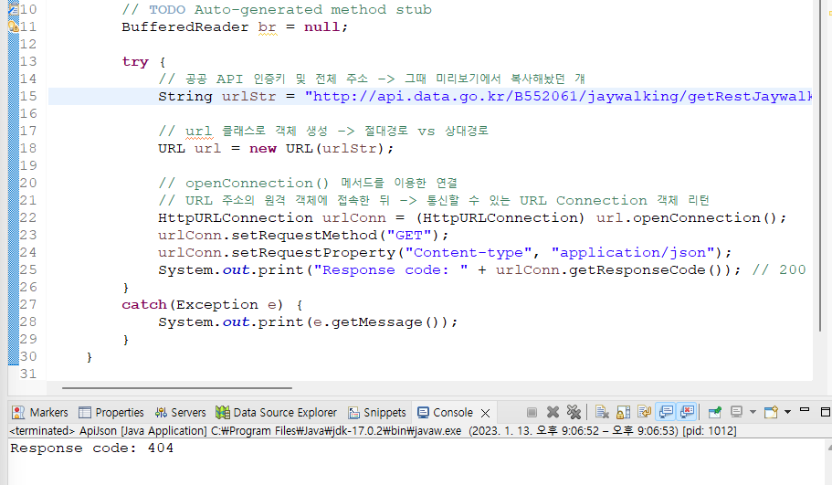

# 📖 목차

[`(섹션 1. JAVA, JSP)`공공데이터 포털 사이트 이용방법](#공공데이터-포털-사이트-이용방법)

[자바(이클립스)에서 공공API 요청 및 출력(1)](#자바이클립스에서-공공api-요청-및-출력1)

[자바(이클립스)에서 공공API 요청 및 출력(2)](#자바이클립스에서-공공api-요청-및-출력2)

[JSON 데이터 웹페이지 테이블로 출력하기 with getJSON(1)](#json-데이터-웹페이지-테이블로-출력하기-with-getjson1)

[JSON 데이터 웹페이지 테이블로 출력하기 with getJSON(2)](#json-데이터-웹페이지-테이블로-출력하기-with-getjson2)

[자바(이클립스)에서 공공API 요청 및 출력(3)](#자바이클립스에서-공공api-요청-및-출력3)

# 공공데이터 포털 사이트 이용방법

- 마이페이지에 사용이 승인된 애들이 있구요

- 신청을 하고 승인을 받아야 사용할 수 있다고 했죠?

- 만 하루 정도면 거의 승인이 되고..

- 너무 오래 안되고있으면 문의를

https://www.data.go.kr/
공공데이터포털

https://www.data.go.kr/data/15058578/openapi.do
도로교통공단_보행자무단횡단사고다발지역정보서비스

- 우리는 이걸 써볼게요

- 앗! 바로 승인 되었어요.. 자동 승인 이었나봐요



- 변경, 연장, 중지 같은 것들을 추가로 신청할 수 있네요


- 미리보기로 들어온건데요, 이 주소가 중요해요

```
https://apis.data.go.kr/B552061/jaywalking/getRestJaywalking?serviceKey=P37PonCaSh4xrrD7KOM%2F84UzYVvltQpLQdr9WY5FgN4aGGR8m3ZKWy7b1Sq%2B4aN163ek%2BwJeu2RnN0R3CfiZEg%3D%3D&searchYearCd=2015&siDo=11&guGun=320&type=json&numOfRows=10&pageNo=1
```

- 뭔가 그.. 값이 보이죠? 미리보기에서 설정했던 그 값들이..

- 마이페이지 -> 내가 신청했던 API 페이지 -> 상세설명

    - 참고하세요

- 우리는 json으로 거의 할테구요

# 자바(이클립스)에서 공공API 요청 및 출력(1)

- Dynamic Web Project

- 꿀팁..

    - import 문제로 빨간 줄 떠있는 애 에서..

    - 커서 올려놓고 `ctrl + shift + o` 하면 임포트 됨

- 버퍼 이용: BufferedReader

    - 버퍼를 이용해서 읽고 쓰는 함수

    - 버퍼: 완충제 이런 역할.. 바로 보내는 게 아니라!

    - 버퍼에 쌓아놨다가 한꺼번에~

    - 임시 메모리 영역

    - 입출력 속도 향상을 위해, 데이터를 일시적으로 메모리 영역의 한 곳에 모아두는 것

    - 효율적으로 입출력 관리

    - 버퍼를 이용하기 때문에, 우리가 입출력 관련 처리 작업을 매우 빠르게 할 수 있는 것

    - 아! 이자식 이거 한창 java로 코테 해볼 때 보던 자식이군요?

- 변수에 여러 값을 넣어서 -> 주소 체계를 만들어야 한다면? -> StringBuilder를 사용

    - String: 불변성 immutable -> 문자열을 더할 때, 매번 새로운 객체를 생성해서 참조함

    - StringBuilder: 문자열을 더해 나갈 때, 새로운 객체를 매번 생성하는 것이 아니라 기존 데이터 값에 추가해가는 방식

    - 속도가 빠르다

    - 얘도 java로 코테 해볼 때 봤던..

    - mutable 속성이고, append(), insert(), delete() 등을 사용해서 값을 변경

    - 보통의 공공 API 방식 -> StringBuilder 사용

- 이하 submodule의 코드 같이 참고 ㄱㄱ

- 응답 코드가 200이 와야 OK 라는 거죠?



- PKIX path building failed 무슨 에러 떠서 당황..

- https://devesim.tistory.com/53

    - 원인은.. Java의 신뢰하는 인증서 목록에 사용하고자 하는 인증기관이 등록되어 있지 않아 접근이 차단되는 것 이었고

    - 인증서를 추가하든지

    - `https` 대신 `http`로 수정하든지 하면 될 것..



- 휴.. ^^



- 의도해서 잘못된 url을 넣어보니.. 404가 뜨네요


# 자바(이클립스)에서 공공API 요청 및 출력(2)

```java
			// 결과 변수
//			String rst = "";
//			String line;
//			while ((line = br.readLine()) != null) {
//				rst += line + "\n";
//			}
//			System.out.println(rst);
			StringBuilder sb = new StringBuilder();
			String line;
			while ((line = br.readLine()) != null) {
				sb.append(line);
			}
			System.out.println(sb.toString());
```

- 결과는 똑같이 나옴

# JSON 데이터 웹페이지 테이블로 출력하기 with getJSON(1)

```
--disable-web-security --user-data-dir="c:\chrome"
```

- 크롬 속성 > 대상 > 맨 끝에 위 text 붙여넣기

- 크롬 브라우저 보안을 변경을 해주는 거라네요

- 테스트 결과를 바로 확인하기 위해서?

    - Ajax 이런건 로컬에서는 안돌아가서..


- ..근데 저는 live server에서 실행시키는거 되니까 안할게요

- `/exam_001`

- 부트스트랩은 버전에 매우 민감쓰

# JSON 데이터 웹페이지 테이블로 출력하기 with getJSON(2)

- js 작업 이어서

# 자바(이클립스)에서 공공API 요청 및 출력(3)

- 상세정보 페이지로 들어가서 맨 아래에 예제 코드가 있다시는데.. 보이지 않네요?! 패치 된 걸까요