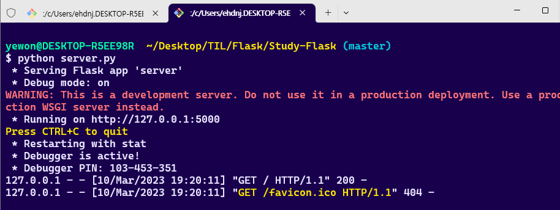

본문에 들어가기에 앞서 잠깐!

```shell
$ pip install flask
```

flask 설치는 이렇게 하면 되구요

```
$ python server.py
```

실행은 이렇게 하면 됐어요~

여기서 server.py는 파일명이죠?



여기서 `http://127.0.0.1:5000` ctrl + 클릭 해서 이동하면 돼요

# Routing

웹 프레임워크 처음 볼때..

이 웹 프레임워크는 라우팅을 어떻게 하는지 이걸 먼저 봐야 해요


라우팅을 할 줄 알면 Flask의 반을 한 것입니다..

```py
@app.route('/')
def index():
    return 'Index Page'

@app.route('/hello')
def hello():
    return 'Hello, World'
```

이런식이거든요

```py
@app.route('/read/1/')
def read():
    return 'read 1'
```

저기 1 부분을 변수로 관리하고 싶어요

```py
@app.route('/read/<id>/')
def read(id):
    print(id)
    return 'read ' + id
```
