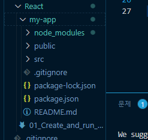
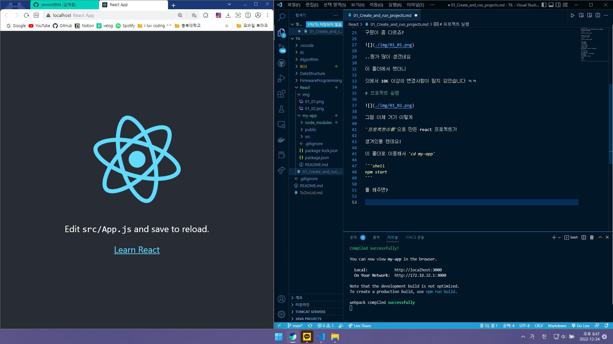

# 1. 프로젝트 생성

npm의 실행 도구인 npx를 사용해서 React 프로젝트를 생성할 수 있다네요!

설치를 원하는 경로에 들어가서

```shell

npx create-react-app 프로젝트이름

```

을 입력해주면 된다고 합니다..

`yarn`을 사용하고 싶다면?

```shell

yarn create react-app 프로젝트이름

```

이렇게 쓴다네요!

구문이 좀 다르죠?



..뭔가 많이 생겼네요

이 폴더에서 했더니

깃에서 10K 이상의 변경사항이 탐지 되었습니다 ㅋㅋ

# 프로젝트 실행


그럼 이제 거기 이렇게

`프로젝트이름`으로 만든 react 프로젝트가

생겨있을 텐데요!

이 폴더로 이동해서 `cd my-app`

```shell
npm start
```

를 해주면?



오~

잘 실행이 됐습니다..

그런데.. 여기는 TIL을 위한 레포지니까

이 react 프로젝트는 다시 없애주도록 해야겠습니다..

안녕히.